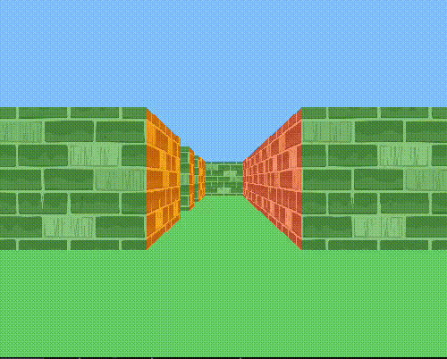

# Cub-3D



## Descrizione

`cub-3d` è un programma in C di introduzione al Raycasting. Il Raycasting è una tecnica di rendering che simula la visione tridimensionale proiettando raggi da un punto di vista e calcolando le intersezioni con oggetti nel mondo virtuale. In questo progetto, abbiamo implementato un semplice motore di gioco 3D che consente agli utenti di esplorare un ambiente virtuale basato su mappe 2D. Le mappe sono rappresentate da file `.cub`, che definiscono la disposizione delle pareti, le texture e la posizione iniziale del giocatore.

## Controlli

-   **W**:Avanti
-   **S**: Indietro
    **A**: Sinistra
-   **D**: Destra
-   **Tasti freccia**: Sposta la visuale
-   **ESC**: Esci dal programma

## Come Compilare ed Eseguire


3.  **Esegui il programma:**
        ```bash
        ./cub-3d mappa.cub
        ```
        # Esempio:
        ./cub-3d maps/map2.cub 
        ```

## Dipendenze

-   `MiniLibX`: Una libreria grafica per X-Window.
-   `libft`: Libreria di funzioni create in C
